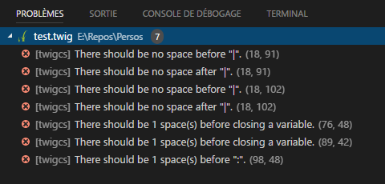

# vscode-twigcs

[](https://marketplace.visualstudio.com/items?itemName=cerzat43.twigcs)
[](https://marketplace.visualstudio.com/items?itemName=cerzat43.twigcs)
[](https://marketplace.visualstudio.com/items?itemName=cerzat43.twigcs)

This linter plugin for [Visual Studio Code](https://code.visualstudio.com/) provides an interface to [twigcs](https://github.com/allocine/twigcs). It will be used with files that have the “Twig” language mode.



## Installation

Visual Studio Code must be installed in order to use this plugin. If Visual Studio Code is not installed, please follow the instructions [here](https://code.visualstudio.com/Docs/editor/setup).

## Linter Installation

Before using this plugin, you must ensure that [twigcs](https://github.com/allocine/twigcs) is installed on your system. The installation can be performed system-wide / project-wide using [composer](https://getcomposer.org/).

Once twigcs is installed, you can proceed to install the vscode-twigcs plugin if it is not yet installed.

### System-wide Installation

The `twigcs` linter can be installed globally using the Composer Dependency Manager for PHP.

1. Install [composer](https://getcomposer.org/doc/00-intro.md).
1. Require `twigcs` package by typing the following in a terminal:

    ```bash
    composer global require allocine/twigcs
    ```

### Project-wide Installation

The `twigcs` linter can be installed in your project using the Composer Dependency Manager for PHP.

1. Install [composer](https://getcomposer.org/doc/00-intro.md).
1. Require `twigcs` package by typing the following at the root of your project in a terminal:

    ```bash
    composer require --dev allocine/twigcs
    ```

### Plugin Installation

1. Open Visual Studio Code.
1. Press `Ctrl+P` on Windows or `Cmd+P` on Mac to open the Quick Open dialog.
1. Type ext install twigcs to find the extension.
1. Press Enter or click the cloud icon to install it.
1. Restart Visual Studio Code when prompted.

## Acknowledgements

The extension architecture is based off of the [Language Server Node Example](https://github.com/Microsoft/vscode-languageserver-node-example) and [phpcs Code Sniffer](https://github.com/ikappas/vscode-phpcs).

## Contributing and Licensing

The project is hosted on [GitHub](https://github.com/cerzat43/vscode-twigcs) where you can [report issues](https://github.com/cerzat43/vscode-twigcs/issues), fork the project and submit pull requests.

The project is available under [MIT license](/), which allows modification and redistribution for both commercial and non-commercial purposes.
